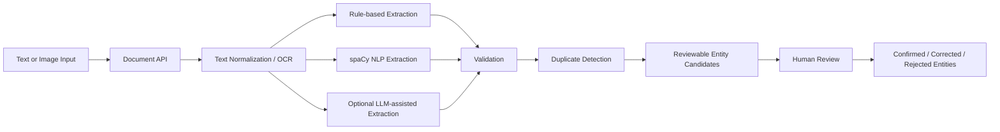
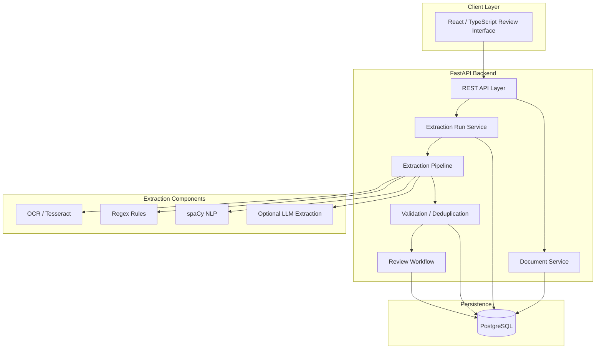
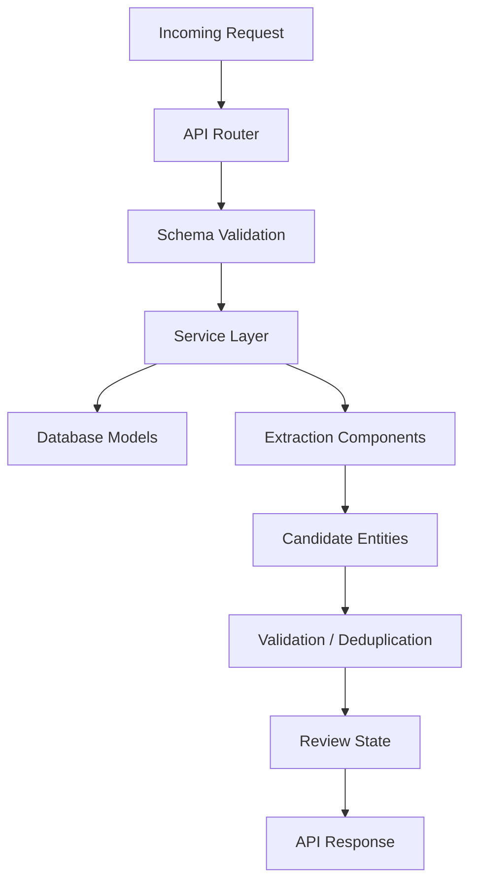
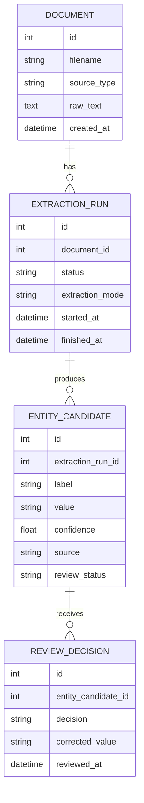
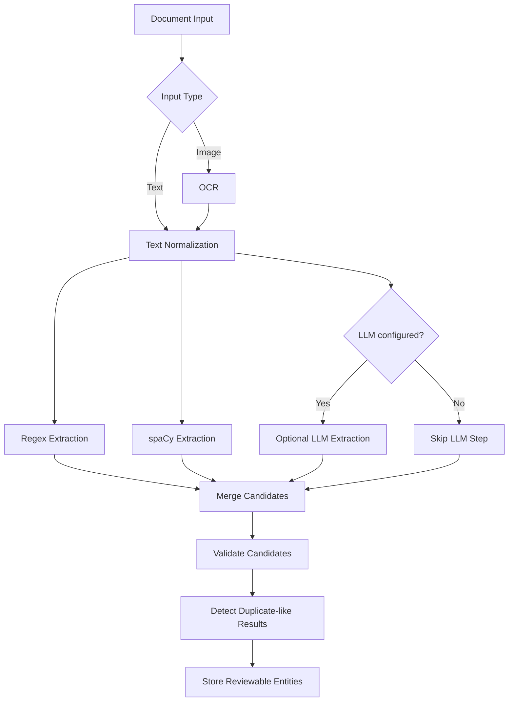
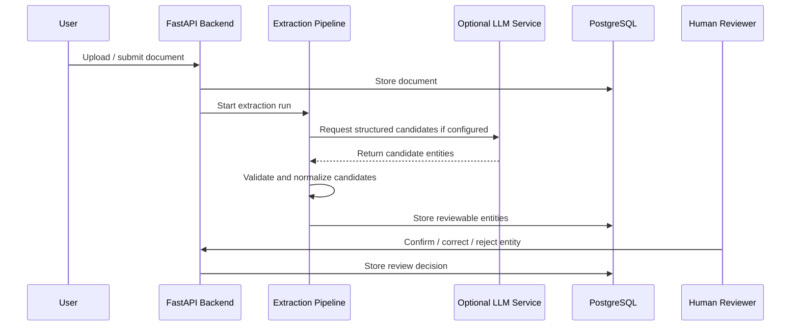
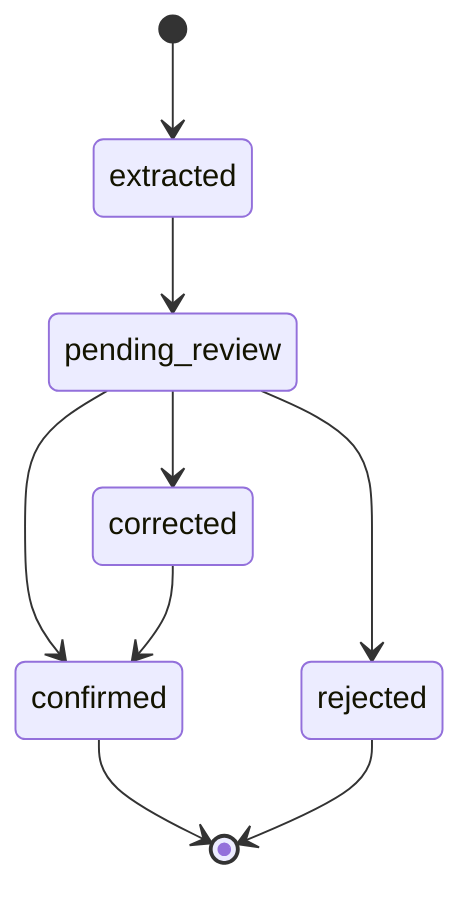
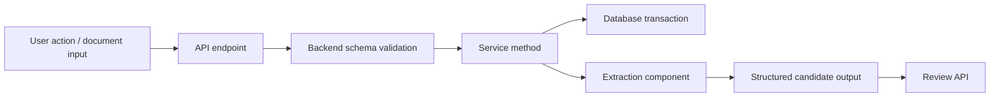
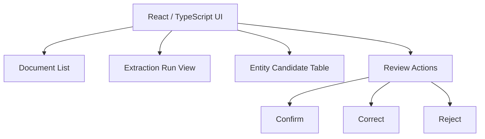

# EntityFlow

**OCR-first full-stack workspace for extracting, validating and reviewing structured entities from unstructured text and image inputs.**

EntityFlow is a portfolio project focused on a practical software problem: unstructured information rarely becomes useful just because a model produced a text answer. In many real workflows, extracted information has to be structured, validated, stored, reviewed and made available through reliable interfaces.

The project combines OCR, rule-based extraction, NLP-based extraction and optional LLM-assisted extraction with a backend-first review workflow. The goal is not to present a production AI platform, but to show how GenAI-adjacent processing can be connected to REST APIs, database models, validation logic and human-in-the-loop review.

---

## Table of Contents

- [Project Snapshot](#project-snapshot)
- [Why This Project Exists](#why-this-project-exists)
- [GenAI Workflow Development Relevance](#genai-workflow-development-relevance)
- [Core Workflow](#core-workflow)
- [High-Level Architecture](#high-level-architecture)
- [Key Features](#key-features)
- [Tech Stack](#tech-stack)
- [Current Implementation Scope](#current-implementation-scope)
- [What This Project Does Not Claim](#what-this-project-does-not-claim)
- [Backend Design](#backend-design)
- [Data Model](#data-model)
- [Extraction Pipeline](#extraction-pipeline)
- [Optional LLM-Assisted Extraction](#optional-llm-assisted-extraction)
- [Human-in-the-Loop Review](#human-in-the-loop-review)
- [API-Oriented Design](#api-oriented-design)
- [Frontend Role](#frontend-role)
- [Project Structure](#project-structure)
- [Local Setup](#local-setup)
- [Environment Variables](#environment-variables)
- [Testing Strategy](#testing-strategy)
- [Engineering Notes](#engineering-notes)
- [Known Limitations](#known-limitations)
- [Possible Next Steps](#possible-next-steps)
- [Repository](#repository)

---

## Project Snapshot

| Area | Description |
|---|---|
| Project type | Full-stack portfolio prototype |
| Main focus | Structured extraction from unstructured text and image inputs |
| Backend | Python, FastAPI, PostgreSQL |
| Frontend | React, TypeScript, Vite |
| AI-adjacent parts | OCR, regex extraction, spaCy NLP, optional LLM-assisted extraction |
| Workflow concept | Document input → extraction run → entity candidates → validation → human review |
| Engineering focus | REST APIs, database-backed workflow, validation, reviewability, Docker-based local setup |
| Maturity | Prototype / portfolio project, not a production platform |

---

## Why This Project Exists

Many AI-assisted demos stop at a free-text answer. EntityFlow focuses on the next step: turning uncertain extracted information into structured, reviewable and API-accessible data.

Typical examples of this problem are:

- extracting names, organizations, dates or identifiers from scanned documents,
- turning OCR output into structured candidates,
- validating extracted values before they are used,
- avoiding duplicate-like entity records,
- keeping a human reviewer in control,
- exposing results through predictable backend interfaces.

The project is intentionally backend-oriented. The important part is not only that information can be extracted, but that extraction is represented as a workflow with state, validation, storage and review.

---

## GenAI Workflow Development Relevance

EntityFlow is **not** an AI agent framework and does **not** claim production-level agent development experience. However, it contains several building blocks that are relevant for GenAI workflow development:

- mapping user or document input to backend processing steps,
- structuring processing steps behind REST APIs,
- using optional LLM-assisted extraction as one step in a controlled workflow,
- validating and deduplicating uncertain results,
- making model-assisted output reviewable by a human,
- storing extraction runs and entity candidates instead of relying on one-shot text output,
- documenting system behavior and workflow boundaries,
- designing a prototype in a way that can later be extended with tests, monitoring or additional integrations.

This makes the project useful as a practical bridge between classic backend development and GenAI-adjacent workflow thinking.

---

## Core Workflow


```mermaid
flowchart LR
    A[Text or Image Input] --> B[Document API]
    B --> C[Text Normalization / OCR]
    C --> D[Rule-based Extraction]
    C --> E[spaCy NLP Extraction]
    C --> F[Optional LLM-assisted Extraction]
    D --> G[Validation]
    E --> G
    F --> G
    G --> H[Duplicate Detection]
    H --> I[Reviewable Entity Candidates]
    I --> J[Human Review]
    J --> K[Confirmed / Corrected / Rejected Entities]
```

The main idea is simple: extraction output should not directly become final truth. It should become a candidate that can be checked, corrected and stored in a structured way.

---

## High-Level Architecture


```mermaid
flowchart TB
    subgraph Client[Client Layer]
        UI[React / TypeScript Review Interface]
    end

    subgraph Backend[FastAPI Backend]
        API[REST API Layer]
        DOC[Document Service]
        RUN[Extraction Run Service]
        EXT[Extraction Pipeline]
        VAL[Validation / Deduplication]
        REV[Review Workflow]
    end

    subgraph Extraction[Extraction Components]
        OCR[OCR / Tesseract]
        RULES[Regex Rules]
        NLP[spaCy NLP]
        LLM[Optional LLM Extraction]
    end

    subgraph Data[Persistence]
        DB[(PostgreSQL)]
    end

    UI --> API
    API --> DOC
    API --> RUN
    RUN --> EXT
    EXT --> OCR
    EXT --> RULES
    EXT --> NLP
    EXT --> LLM
    EXT --> VAL
    VAL --> REV
    DOC --> DB
    RUN --> DB
    VAL --> DB
    REV --> DB
```

---

## Key Features

### Document-oriented workflow

EntityFlow treats each input as a document-like object. A document can be text-based or image-based, depending on the input source and current implementation state.

### OCR-first processing

For image-based inputs, OCR can be used to convert visual information into text that can be processed further.

### Multiple extraction approaches

The project is designed around a combination of extraction methods:

- regex-based extraction for predictable patterns,
- spaCy-based NLP for language-oriented entity detection,
- optional LLM-assisted extraction for more flexible candidate generation.

### Reviewable entity candidates

Extracted values are represented as entity candidates. They can be reviewed instead of being accepted automatically.

### Human-in-the-loop review

The review workflow is important because AI/OCR/NLP outputs can be incomplete or wrong. A reviewer should be able to confirm, correct or reject candidates.

### API-based structure

The workflow is exposed through backend resources such as documents, extraction runs and entities. This makes the system easier to test, extend and integrate.

### Docker-based local setup

Docker Compose is used to keep backend, frontend and database setup easier to reproduce locally.

---

## Tech Stack

| Layer | Technology |
|---|---|
| Backend | Python, FastAPI |
| Data validation / schemas | Pydantic |
| Database | PostgreSQL |
| ORM / database access | SQLAlchemy or comparable backend persistence layer |
| OCR | Tesseract / OCR pipeline |
| NLP | spaCy, regex-based extraction |
| Optional LLM step | LLM API integration, only when configured |
| Frontend | React, TypeScript, Vite |
| Local infrastructure | Docker, Docker Compose |
| Testing direction | pytest, API-level tests, validation tests |

The exact implementation can evolve, but the project is intentionally built around backend workflows, structured data and reviewability.

---

## Current Implementation Scope

EntityFlow should be understood as a **prototype**. Its purpose is to demonstrate architecture, workflow thinking and practical implementation skills.

The project focuses on:

- backend resource modeling,
- REST API structure,
- document and extraction-run concepts,
- entity candidate modeling,
- OCR/NLP/regex/optional LLM extraction flow,
- validation and duplicate-detection thinking,
- human review workflow,
- Docker-based local development.

Depending on the current repository state, some parts may be implemented more fully than others. Sections marked as strategy or possible next steps are not meant to imply finished production features.

---

## What This Project Does Not Claim

This project does **not** claim to be:

- a production-ready AI platform,
- an enterprise document processing system,
- a full agentic AI framework,
- a replacement for human review,
- a fully monitored production service,
- a benchmarked OCR or NLP engine,
- a complete end-to-end commercial product.

It is a practical student/portfolio project that shows how backend engineering, data processing and GenAI-adjacent components can be connected in a structured way.

---

## Backend Design

The backend is the central part of the project. It is responsible for:

- accepting and representing input documents,
- starting extraction runs,
- storing processing results,
- exposing entity candidates,
- applying validation and duplicate-detection logic,
- supporting review actions,
- making the workflow accessible through REST APIs.

### Backend responsibility diagram


```mermaid
flowchart TD
    A[Incoming Request] --> B[API Router]
    B --> C[Schema Validation]
    C --> D[Service Layer]
    D --> E[Database Models]
    D --> F[Extraction Components]
    F --> G[Candidate Entities]
    G --> H[Validation / Deduplication]
    H --> I[Review State]
    I --> J[API Response]
```

### Why this matters

For AI-assisted applications, backend design is especially important because the system has to manage uncertainty. EntityFlow does this by treating extraction results as stored, reviewable objects instead of immediate final answers.

---

## Data Model

The conceptual model is based on a few core resources.


```mermaid
erDiagram
    DOCUMENT ||--o{ EXTRACTION_RUN : has
    EXTRACTION_RUN ||--o{ ENTITY_CANDIDATE : produces
    ENTITY_CANDIDATE ||--o{ REVIEW_DECISION : receives

    DOCUMENT {
        int id
        string filename
        string source_type
        text raw_text
        datetime created_at
    }

    EXTRACTION_RUN {
        int id
        int document_id
        string status
        string extraction_mode
        datetime started_at
        datetime finished_at
    }

    ENTITY_CANDIDATE {
        int id
        int extraction_run_id
        string label
        string value
        float confidence
        string source
        string review_status
    }

    REVIEW_DECISION {
        int id
        int entity_candidate_id
        string decision
        string corrected_value
        datetime reviewed_at
    }
```

This model is intentionally simple enough for a portfolio prototype, but it still shows the important separation between source input, processing attempt, extracted candidates and review decisions.

---

## Extraction Pipeline

EntityFlow uses a pipeline-oriented view of extraction.


```mermaid
flowchart TD
    A[Document Input] --> B{Input Type}
    B -->|Image| C[OCR]
    B -->|Text| D[Text Normalization]
    C --> D
    D --> E[Regex Extraction]
    D --> F[spaCy Extraction]
    D --> G{LLM configured?}
    G -->|Yes| H[Optional LLM Extraction]
    G -->|No| I[Skip LLM Step]
    E --> J[Merge Candidates]
    F --> J
    H --> J
    I --> J
    J --> K[Validate Candidates]
    K --> L[Detect Duplicate-like Results]
    L --> M[Store Reviewable Entities]
```

### Regex extraction

Regex-based extraction is useful for predictable patterns such as:

- dates,
- identifiers,
- e-mail-like values,
- fixed labels,
- repeated structured fields.

### spaCy extraction

spaCy-based extraction is useful for language-oriented entity candidates, for example:

- persons,
- organizations,
- locations,
- other entity-like spans depending on model and language support.

### Optional LLM-assisted extraction

The LLM step is optional. It should support extraction, not replace validation or review.

---

## Optional LLM-Assisted Extraction

The LLM-assisted step is designed as a controlled part of the pipeline. It should not be treated as an uncontrolled final answer generator.

### Intended role of the LLM step

- suggest structured entity candidates,
- help with less predictable input formats,
- support extraction where simple rules are insufficient,
- return structured outputs that can be validated,
- remain optional and configurable.

### Safety boundary

The project should keep the following boundary clear:

> LLM output is a candidate, not final truth.


```mermaid
sequenceDiagram
    participant User
    participant API as FastAPI Backend
    participant Pipeline as Extraction Pipeline
    participant LLM as Optional LLM Service
    participant DB as PostgreSQL
    participant Reviewer as Human Reviewer

    User->>API: Upload / submit document
    API->>DB: Store document
    API->>Pipeline: Start extraction run
    Pipeline->>LLM: Request structured candidates if configured
    LLM-->>Pipeline: Return candidate entities
    Pipeline->>Pipeline: Validate and normalize candidates
    Pipeline->>DB: Store reviewable entities
    Reviewer->>API: Confirm / correct / reject entity
    API->>DB: Store review decision
```

### Why this is relevant for GenAI workflow development

The important engineering idea is not simply using an LLM. The important idea is connecting LLM-assisted output to:

- backend resources,
- APIs,
- validation logic,
- review state,
- data persistence,
- technical documentation.

---

## Human-in-the-Loop Review

Human-in-the-loop review is a central concept in EntityFlow.


```mermaid
stateDiagram-v2
    [*] --> extracted
    extracted --> pending_review
    pending_review --> confirmed
    pending_review --> corrected
    pending_review --> rejected
    corrected --> confirmed
    confirmed --> [*]
    rejected --> [*]
```

### Review actions

A reviewer should be able to:

- inspect extracted candidates,
- compare extracted values with the original input,
- confirm correct entities,
- correct wrong values,
- reject irrelevant candidates,
- keep the final structured output understandable.

### Why reviewability matters

OCR, NLP and LLM-based extraction can all fail. A reliable workflow should therefore make uncertainty visible and manageable.

---

## API-Oriented Design

EntityFlow is designed around API resources rather than hidden scripts.

### Conceptual API resources

| Resource | Responsibility |
|---|---|
| Document | Store and represent source input |
| Extraction Run | Track one processing attempt |
| Entity Candidate | Represent extracted structured information |
| Review Decision | Store human confirmation, correction or rejection |

### Example endpoint directions

The exact endpoint names may differ depending on implementation, but the conceptual API shape is:

```text
POST   /documents
GET    /documents
GET    /documents/{document_id}
POST   /documents/{document_id}/extraction-runs
GET    /extraction-runs/{run_id}
GET    /extraction-runs/{run_id}/entities
PATCH  /entities/{entity_id}/review
```

### Mapping input to backend actions


```mermaid
flowchart LR
    A[User action / document input] --> B[API endpoint]
    B --> C[Backend schema validation]
    C --> D[Service method]
    D --> E[Database transaction]
    D --> F[Extraction component]
    F --> G[Structured candidate output]
    G --> H[Review API]
```

This API-first thinking is important because practical AI-assisted workflows usually need to interact with existing systems rather than remain isolated demos.

---

## Frontend Role

The frontend is not the main technical focus, but it supports the review workflow.

A React/TypeScript interface can be used to:

- display documents,
- show extraction runs,
- list entity candidates,
- expose review actions,
- make corrections visible,
- provide a simple human-in-the-loop experience.


```mermaid
flowchart TB
    UI[React / TypeScript UI] --> A[Document List]
    UI --> B[Extraction Run View]
    UI --> C[Entity Candidate Table]
    UI --> D[Review Actions]
    D --> E[Confirm]
    D --> F[Correct]
    D --> G[Reject]
```

---

## Project Structure

The repository is intended to be organized around backend, frontend and infrastructure files. The exact structure may evolve as the prototype is extended.

```text
entityflow/
├── backend/
│   ├── app/
│   │   ├── api/
│   │   ├── core/
│   │   ├── models/
│   │   ├── schemas/
│   │   ├── services/
│   │   └── main.py
│   ├── tests/                  # intended / growing test area
│   ├── requirements.txt
│   └── Dockerfile
│
├── frontend/
│   ├── src/
│   ├── package.json
│   └── Dockerfile
│
├── docker-compose.yml
├── README.md
└── .env.example                # optional, if included in the repository
```

If the current repository structure differs slightly, the important separation remains:

- backend API and processing logic,
- frontend review interface,
- database and local infrastructure,
- documentation and test strategy.

---

## Local Setup

### 1. Clone the repository

```bash
git clone https://github.com/yusufoemerkaratas/entityflow.git
cd entityflow
```

### 2. Create environment file if needed

If an example environment file exists:

```bash
cp .env.example .env
```

Then adjust local values if needed.

### 3. Start with Docker Compose

```bash
docker compose up --build
```

This should start the local development environment according to the services defined in `docker-compose.yml`.

### 4. Stop containers

```bash
docker compose down
```

### 5. Reset local volumes if needed

```bash
docker compose down -v
```

Use this only when local database state should be removed.

---

## Environment Variables

Typical environment variables for this kind of prototype include database configuration and optional LLM configuration.

```env
DATABASE_URL=postgresql://postgres:postgres@db:5432/entityflow
POSTGRES_USER=postgres
POSTGRES_PASSWORD=postgres
POSTGRES_DB=entityflow

# Optional LLM configuration
LLM_PROVIDER=
LLM_API_KEY=
LLM_MODEL=
```

Do not commit real API keys or secrets.

The optional LLM step should work only when explicitly configured. The rest of the extraction workflow should remain understandable without requiring an external AI service.

---

## Testing Strategy

EntityFlow should be tested at the level where mistakes are most likely to affect workflow reliability.

The current prototype focuses on backend workflow structure. The test suite can be expanded around API behavior, validation logic and review actions.

Important test areas include:

- document creation,
- extraction run creation,
- validation logic,
- duplicate detection,
- entity review actions,
- API response behavior,
- error handling for invalid inputs.

### Example test categories

```text
tests/
├── test_documents.py
├── test_extraction_runs.py
├── test_entities.py
├── test_review_workflow.py
└── test_validation.py
```

If backend tests are available, they can typically be run with:

```bash
cd backend
pytest
```

### Why testing matters here

For AI-assisted workflows, testing should not only check whether the application starts. It should also check whether uncertain extraction results are handled in a controlled way.

Examples of useful behavior to test:

- a document can be created,
- an extraction run can be started,
- extracted candidates are stored as entities,
- duplicate-like entities can be detected,
- a review decision changes entity state correctly,
- invalid input is rejected with a clear error.

---

## Engineering Notes

### Backend-first structure

The project is intentionally not only a frontend demo. Most of the important logic is modeled in the backend through resources, services and database-backed workflows.

### Transparent processing

Extraction is represented as a process rather than a hidden one-shot function. This makes it easier to reason about errors, review state and future improvements.

### Reviewability over automation hype

The project does not claim that AI or OCR output is always correct. It focuses on structured candidates and reviewable results.

### API integration mindset

The workflow is designed in a way that could be connected to other systems through APIs. This is important for practical AI-assisted applications.

### Reproducibility

Docker Compose makes the project easier to run locally and reduces environment-specific setup problems.

---

## Known Limitations

EntityFlow is a prototype and has limitations:

- it is not production infrastructure,
- OCR quality depends on input quality and OCR configuration,
- LLM-assisted extraction is optional and depends on external configuration,
- extraction quality needs further evaluation on realistic datasets,
- review workflows can be extended with roles, audit logs and permissions,
- tests and documentation should grow together with implementation,
- monitoring and deployment hardening are not the current focus.

These limitations are intentional to keep the project honest and understandable.

---

## Possible Next Steps

Possible improvements include:

- expanding API-level tests,
- adding more validation rules,
- improving duplicate detection,
- adding confidence scoring per extraction source,
- adding a clearer audit trail for review decisions,
- improving frontend review usability,
- adding sample documents for reproducible demos,
- documenting concrete API examples with request and response bodies,
- adding structured LLM prompts and output schemas,
- separating extraction providers behind a cleaner interface,
- adding lightweight monitoring for extraction runs.

---

## What This Project Demonstrates

EntityFlow demonstrates practical experience with:

- Python backend development,
- FastAPI-based REST APIs,
- PostgreSQL-backed data modeling,
- structured workflow design,
- OCR-assisted text extraction,
- regex-based extraction,
- spaCy-based NLP processing,
- optional LLM-assisted extraction,
- validation and duplicate-detection thinking,
- human-in-the-loop review,
- React/TypeScript frontend basics,
- Docker-based local development,
- technical documentation of AI-adjacent workflows.

For GenAI workflow development contexts, the most relevant parts are:

- mapping input to backend actions,
- designing structured API resources,
- connecting AI-assisted output to validation logic,
- making uncertain results reviewable,
- documenting technical workflows clearly.

---

## Repository

GitHub: [github.com/yusufoemerkaratas/entityflow](https://github.com/yusufoemerkaratas/entityflow)

---

## Final Note

EntityFlow is a focused portfolio prototype. It is intentionally honest about its scope: it does not claim to be a complete production AI platform, but it demonstrates how backend engineering, structured data processing and optional GenAI-assisted extraction can be combined in a reviewable workflow.
